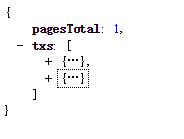
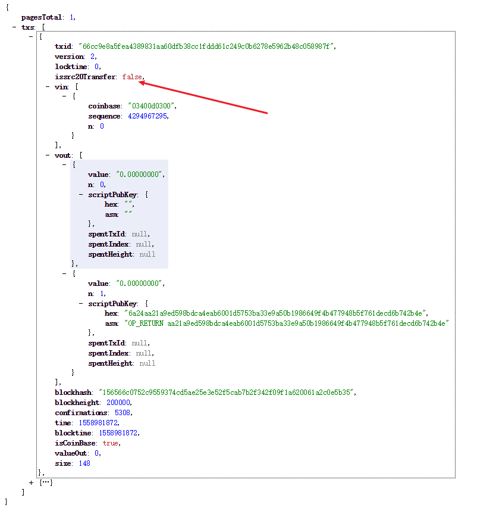

## Silubium 简介

Silubium公链第二代SLU，于新加坡时间2018-07-28 17:33:01启动产生创世块。
SLU是一条集多种开放功能于一体的公链，可以实现基于UTXO安全模型的智能合约，并创新了POS共识协议新机制SILKWORM，发明了数据上链协议SILKSCREEN。主要特点有：
1. 比特币网络是目前最大的一个区块链技术的生态系统，以太坊第一次将智能合约的概念从理论变成实际，拓展了区块链技术的边界。SLU从设计之初就充分考虑了兼容性，在SLU上拥有比特币所有特性，基于EVM的智能合约可以直接在SLU上部署运行。
2. 与比特币和以太坊采用POW机制挖矿不一样，SLU提出了SILKWORM共识机制。SILKWORM在POS基础上进行了创新：
    -  以用户持有的UTXO进行挖矿，UTXO不论大小都有机会获得挖矿资格，这种方式大大减小了POW机制下的能源浪费；
    -  区块打包成功后，矿工会获得区块内所有交易的手续费，另外获得1SLU区块奖励，手续费和区块奖励会分5次发放，第1次及时发放，后4次在后续101-104个区块发放，这种方式提高了潜在攻击者的成本，降低了安全隐患；
    -  UTXO在获得区块打包资格时，SLU会判断持有期是否超过30天，若超过按0.58%月利息发放，但最多不超过360天，这种方式鼓励SLU持有者在线并获得奖励，在线节点越多SLU越稳定、安全。
3. 区块链除了具备价值传递的功能外，其去中心化、不可篡改的等特性更能解决在实体经济具体场景一些痛点，SLU的区块大小增至8M，数据直接上链1024B，智能合约承载最大量32M，并发明了数据上链协议SILKSCREEN：
    -  上链数据参数通过智能合约设定，可以设置是否加密、是否授权第三方查看；
    -  约定了数据封装格式；
    -  设计了配套的数据上链和查询接口。
4. SLU设计了低交易成本机制，SLU直接转帐按转帐金额比例计算**0.00005%-0.00001%**，交易量越大费率越低，并限定了最小值为**0.0001**SLU，最大值为**0.5**SLU。智能合约调用免费，发送操作需消耗少量GAS，最低GAS价格为**0.00000010**SLU。

#### [官网地址](http://www.silubium.org) [区块浏览器](https://silkchain.silubium.org)  [钱包下载](http://update.silubium.org)  [离线工具包](https://github.com/SilubiumProject/silubium-java-lib)

## Silubium Lib 简介

**java版的Silubium离线工具包，具有以下特点：**
1. **[离线生成Silubium地址](#离线生成Silubium地址)（可脱离网络使用）**
2. **[离线构造Silubium链上标准的SLU交易 token交易](#离线构造Silubium链上标准的SLU交易token交易)（连接网络下使用）**
3. **[校验地址的合法性](#校验地址的合法性)（可脱离网络使用）**
4. **[获取地址SLU余额](#获取地址SLU余额)（连接网络下使用）**
5. **[获取地址TOKEN余额](#获取地址TOKEN余额)（连接网络下使用）**
6. **[获取地址UTXO](#获取地址UTXO)（连接网络下使用）**
7. **[获取指定高度的交易信息](#获取指定高度的交易信息)（连接网络下使用）**
8. **[获取交易明细](#获取交易明细)（连接网络下使用）**
9. **[广播交易](#广播交易)（连接网络下使用）**
10. **[获取TOKEN信息](#获取TOKEN信息)（连接网络下使用）**
11. **[CONTRACT](#CONTRACT)**
12. **[CryptoCurrency Exchange Guide](#CryptoCurrencyExchangeGuide)**

[SilkTrader](http://st.bi)
- 需要连接网络使用的功能，建议在项目启动是进行连接参数的实例化
- 如有需要动态切换参数，使用CurrentNetParams设置即可
- 该工具包运行环境最低为 jdk1.8 直接下载release jar包 [silubium-api](https://github.com/SilubiumProject/silubium-java-lib/releases) 项目结构为pom结构

maven引入

```java
        <dependency>
            <groupId>com.deaking.www.wallet</groupId>
            <artifactId>silubium-api</artifactId>
            <version>1.1.0</version>
        </dependency>
        
        // 如果出现okhttp包冲突，可使用以下方式
        <dependency>
            <groupId>com.deaking.www.wallet</groupId>
            <artifactId>silubium-api</artifactId>
            <version>1.1.0</version>
            <exclusions>
                <exclusion>
                    <groupId>com.squareup.okhttp3</groupId>
                    <artifactId>okhttp</artifactId>
                </exclusion>
                <exclusion>
                    <groupId>com.squareup.okhttp3</groupId>
                    <artifactId>logging-interceptor</artifactId>
                </exclusion>
            </exclusions>
        </dependency>

        <!--用于解决包冲突的问题-->
        <dependency>
            <groupId>com.squareup.okhttp3</groupId>
            <artifactId>okhttp</artifactId>
            <version>3.12.1</version>

        </dependency>
        <dependency>
            <groupId>com.squareup.okhttp3</groupId>
            <artifactId>logging-interceptor</artifactId>
            <version>3.12.1</version>
        </dependency>
```
```java
// 启动参数初始化设置，建议在启动时加入该静态启动代码
static {
        // 加载BC加密驱动
        Security.addProvider(new org.bouncycastle.jce.provider.BouncyCastleProvider());
        // 交易确认数
        CurrentNetParams.setDefault_confirm(6);
        // 是否主链，默认true
        CurrentNetParams.setUseMainNet(true);
        // 新增燃料价格
        CurrentNetParams.setGasPrice(10);
        // 新增燃料限制
        CurrentNetParams.setGasLimit(800000);
        // 接口主机地址和端口
        CurrentNetParams.setBaseUrl("https://sluapi.silubium.org/");

    }
```

如果项目启动时报加密相关的错误，请下载jdk8专用的无限制策略文件[jce-policy](http://www.oracle.com/technetwork/java/javase/downloads/jce8-download-2133166.html)，然后到$JAVA_HOME\jre\lib\security目录下替换对应的jar包


#### 离线生成Silubium地址

- 测试链地址开头：SLS
- 正式链地址开头：SLU

```java
// 使用bip44协议进行离线地址生成,具体规则可参考bip44 silubium
        @Test
        public void testbip44EthereumEcKey() throws MnemonicException.MnemonicLengthException, ValidationException {
                        
            List<String> mnemonicWordsInAList = new ArrayList<>();
            mnemonicWordsInAList.add("cupboard");
            mnemonicWordsInAList.add("shed");
            mnemonicWordsInAList.add("accident");
            mnemonicWordsInAList.add("simple");
            mnemonicWordsInAList.add("marble");
            mnemonicWordsInAList.add("drive");
            mnemonicWordsInAList.add("put");
            mnemonicWordsInAList.add("crew");
            mnemonicWordsInAList.add("marine");
            mnemonicWordsInAList.add("mistake");
            mnemonicWordsInAList.add("shop");
            mnemonicWordsInAList.add("chimney");
            mnemonicWordsInAList.add("plate");
            mnemonicWordsInAList.add("throw");
            mnemonicWordsInAList.add("cable");
            // 123为默认密码，可自行替换
            byte[] seed = MnemonicCode.toSeed(mnemonicWordsInAList, "123");
            ExtendedKey extendedKey = ExtendedKey.create(seed);
            CoinPairDerive coinKeyPair = new CoinPairDerive(extendedKey);
            // 使用bip44路径生成，建议BIP44.m().purpose44().coinType(CoinTypes.SLIUBIUM).account(1).external().address(此处为地址索引，为遵循bip44规则，其值范围为0到19最佳);
            // 当address索引累计到19后，可以增加account索引以生成更多地址
            //使用bip44路径生成，建议BIP44.m().purpose44().coinType(CoinTypes.SLIUBIUM).account(增加此处索引).external().address(19);
            // 完成bip44 路径示例 m/44'/5920'/4'/0/12
            AddressIndex address = BIP44.m().purpose44().coinType(CoinTypes.SLIUBIUM).account(1).external().address(1);
            // 第一个参数为地址索引路径，然后是链参数，是否为测试链
            ECKeyPair master = coinKeyPair.derive(address, new SLUNetworkParameters(), !CurrentNetParams.getUseMainNet());
            System.out.println(address.toString());
            try {
                // 合法的slu地址正式链前三个字符为SLU，测试链前三个字符为SLS，截掉"SL"后地址规则满足base58编码
                String sluAddress = "SL"+master.getAddress();
                System.out.println("privateKey" + "..." + master.getPrivateKey());
                System.out.println("publicKey" + "..." + master.getPublicKey());
            } catch (Exception e) {
                e.printStackTrace();
            }
          }
```

#### 离线构造Silubium链上标准的SLU交易token交易

[查看Silubium TOKEN LIST](https://silkchain.silubium.org/token/tokenlist.html)

```java
/**
     * 测试创建SLU交易或者TOKEN交易 （可以同时发送SLU和TOKEN）
     * 每笔交易均会消耗slu，token不会被消耗
     * @param
     * @return true
     * @author shenzucai
     * @time 2018.12.05 19:20
     */
    @Test
    public void testCreateNewTx() throws UnsupportedEncodingException {
        try {
            SendRawTransactionRequest sendRawTransactionRequest = new SendRawTransactionRequest();
            sendRawTransactionRequest.setAllowAbsurdFees(true);

            //接收地址
            List<SluTransferResult> addresses = new ArrayList<>();

            // SLU接收地址
            List<SendGasResult> sendGasResults = new ArrayList<>();
            sendGasResults.add(new SendGasResult(Address.fromBase58(CurrentNetParams.getNetParams(), "SLSSFpE5Gbbg84v2FqFkZAasrmqfNNNZqvwr"),new BigDecimal("10000")));
            

            // TOKEN接收地址
            BigDecimal bigDecimal = new BigDecimal("10000");
            addresses.add(new SluTransferResult("SLSSFpE5Gbbg84v2FqFkZAasrmqfNNNZqvwr",bigDecimal));
            
            Map<String, String> map = new HashMap(1);
            // 合约地址 发送TOKEN交易时，合约地址必须填写 
            String contractAddress = "1151b5d84e3d7e14c6115b2b6eac8d66d816672f";
            // 该map只能只能放一个  发送地址和私钥
            map.put("sendAddress","privateKey");

            try {
                // 构建交易
                TransactionCheck transactionCheck = TransactionUtil.createNewTx(map //发送地址，有且仅有一个
                // 合约地址，当合约地址为空时，则为SLU交易，当合约地址不为空时，则为合约交易或者（合约和SLU）交易
                , contractAddress
                // TOKEN 接收地址，可多个，建议每次低于10，防止交易体积过大，具体可以实测，理论上可以放1000个
                , addresses
                // 默认基础手SLU续费，其余SLU手续费会根据交易体积自动计算，应确保发送地址SLU至少大于0.0801 SLU
                , new BigDecimal("0.0001").toPlainString()
                // SLU 发送，可多个，建议每次低于10个，防止交易体积过大，具体可以实测，理论上可以放1200个
                , sendGasResults
                // 该金额用于过滤 utxo 中过小的金额，如果为0则不会过滤任何 utxo 金额
                , BigDecimal.ZERO
                // 该出可用于高并发处理，将前面一笔交易使用的utxo暂时保存，构建新的交易时，将已经消耗过的utxo放于该变量，
                // 然后程序会排除这些utxo（用于钱包广播节点和网络造成的问题，解决短时间同一笔utxo被多笔交易使用的问题）
                ,null);
                sendRawTransactionRequest.setRawtx(transactionCheck.getTransactionBytes());
            } catch (Exception e) {
                e.printStackTrace();
            }
            SilubiumService rpcService = Generator.createService(SilubiumService.class, CurrentNetParams.getBaseUrl());
            // 广播交易 返回交易hash
            SendResult sendResult = Generator.executeSync(rpcService.sendRawTransaction(sendRawTransactionRequest));
            System.out.println(sendResult.getTxid());
        } catch (ApiException e) {
            System.out.println(e.getError());
        }
    }
```

#### 校验地址的合法性

```java
//使用该工具类进行地址合法性校验 com.spark.bc.wallet.api.util.AddressUtil

    try {
            AddressUtil.validAddress("SLSjc1JSj9oqYkq7fdUFZaGeG8uisYVRihbm");
        } catch (Exception e) {
            e.printStackTrace();
        }
    
    //如果抛出异常则地址不合法
    
    //验证地址是否有效的核心代码：
    Address.fromBase58(CurrentNetParams.getNetParams(), address);
    //即上述实例化地址时是否异常，无异常则为合法地址，否则地址不合法
```

#### 获取地址SLU余额

```java
    /**
     * 测试获取slu余额 可以查询多个地址，使用英文逗号分隔多个地址即可
     * @author shenzucai
     * @time 2018.12.05 19:20
     * @param
     * @return true
     */
    @Test
    public void testGetAddrBalance() throws UnsupportedEncodingException {


        SilubiumService rpcService = Generator.createService(SilubiumService.class, CurrentNetParams.getBaseUrl());
        List<Balance> balances = Generator.executeSync(rpcService.getAddrBalance("SLSjc1JSj9oqYkq7fdUFZaGeG8uisYVRihbm"));
        //List<Balance> balances1 = Generator.executeSync(rpcService.getAddrBalance("SLSSFpE5Gbbg84v2FqFkZAasrmqfNNNZqvwr,SLSjc1JSj9oqYkq7fdUFZaGeG8uisYVRihbm"));
        System.out.println(balances);
    }
```

#### 获取地址TOKEN余额

```java
/**
     * 测试获取获取token余额,可以查询多个地址，使用英文逗号分隔多个地址即可
     * @author shenzucai
     * @time 2018.12.05 19:20
     * @param
     * @return true
     */
    @Test
    public void testGetAddrSrcBalance() throws UnsupportedEncodingException {

        SilubiumService rpcService = Generator.createService(SilubiumService.class, CurrentNetParams.getBaseUrl());
        SrcBalance balances = Generator.executeSync(rpcService.getAddrSrcBalance("1e88227d9f21cd26ee06f0f1473e119bbf392fc0", "SLSjc1JSj9oqYkq7fdUFZaGeG8uisYVRihbm"));
        // SrcBalance balances1 = Generator.executeSync(rpcService.getAddrSrcBalance("1e88227d9f21cd26ee06f0f1473e119bbf392fc0", "SLSjc1JSj9oqYkq7fdUFZaGeG8uisYVRihbm,SLSjc1JSj9oqYkq7fdUFZaGeG8uisYVRihbm"));
        System.out.println(balances);
    }
```

#### 获取地址UTXO

```java
/**
     * 测试获取未花费输出,可以查询多个地址，使用英文逗号分隔多个地址即可
     * @author shenzucai
     * @time 2018.12.05 19:20
     * @param
     * @return true
     */
    @Test
    public void testGetAddrUTXOs() throws UnsupportedEncodingException {

        SilubiumService rpcService = Generator.createService(SilubiumService.class, CurrentNetParams.getBaseUrl());
        List<UTXO> utxos = Generator.executeSync(rpcService.getAddrUTXOs("SLSNYr8T1dDFMCjJwYCKp5XAVNjpFNvUPqTo" //地址
        // 需要获取多少金额的utxo，如果为null或者0则默认获取该地址全部的utxo
        ,new BigDecimal("0")
        // utxo的确认数，默认为6个
        ,CurrentNetParams.getDefault_confirm()));
        // List<UTXO> utxos1 = Generator.executeSync(rpcService.getAddrUTXOs("SLSjc1JSj9oqYkq7fdUFZaGeG8uisYVRihbm,SLSQWyo7Ceqgirz8W2dHS7aGcXfef74J68Wx",null,CurrentNetParams.getDefault_confirm()));
        System.out.println(utxos);
    }
```

#### 获取指定高度的交易信息

```java
/**
     * 测试获取块的交易，该结果包含交易所有明细，如果只是获取指定交易明细的，请参考8. 获取交易明细（连接网络下使用）
     * @author shenzucai
     * @time 2018.12.05 19:20
     * @param
     * @return true
     */
    @Test
    public void testListTransaction() throws UnsupportedEncodingException {

        SilubiumService rpcService = Generator.createService(SilubiumService.class, CurrentNetParams.getBaseUrl());
        com.spark.bc.wallet.api.entity.slu.Transaction transaction = Generator.executeSync(rpcService.listTransaction("2000" //该参数使用字符串，具体的值可以是块的高度，或者块的hash值
        // 分页参数，页码数，从0开始
        ,0
        // 分页参数，每页记录数，一旦开始进行交易扫描，不建议再度修改该值，以免造成交易混乱
        ,10));
        System.out.println(transaction);
    }
```

#### 获取交易明细

```java
/**
     * 测试获取交易根据交易hash值
     * @author shenzucai
     * @time 2018.12.05 19:20
     * @param
     * @return true
     */
    @Test
    public void testGetTransaction() throws UnsupportedEncodingException {

        SilubiumService rpcService = Generator.createService(SilubiumService.class, CurrentNetParams.getBaseUrl());
        com.spark.bc.wallet.api.entity.slu.history.Transaction  transaction = Generator.executeSync(rpcService.getTransaction("99ef1b55b6a625e60677d71a6a15661c6992a021b3cd6e29e32ba935a6ff0522"));
        System.out.println(transaction);
    }
```

#### 广播交易

```java
 //广播已经构造好的交易，需要配合构造交易的函数使用
         // 构造广播对象
         SendRawTransactionRequest sendRawTransactionRequest = new SendRawTransactionRequest();
         sendRawTransactionRequest.setAllowAbsurdFees(true);
         
         // 放入交易体
         sendRawTransactionRequest.setRawtx("交易体放这里");// 可以参考2. 离线构造Silubium链上标准的SLU交易 token交易进行使用
         SilubiumService rpcService = Generator.createService(SilubiumService.class, CurrentNetParams.getBaseUrl());
         // 广播交易 返回交易hash
         SendResult sendResult = Generator.executeSync(rpcService.sendRawTransaction(sendRawTransactionRequest));
         System.out.println(sendResult.getTxid());
```

#### 获取TOKEN信息

```java
/**测试获取合约信息
     * @author shenzucai
     * @time 2018.12.05 19:20
     * @param
     * @return true
     */
    @Test
    public void testGetContract() throws UnsupportedEncodingException {
        SilubiumService rpcService = Generator.createService(SilubiumService.class, CurrentNetParams.getBaseUrl());
        Contract contract = Generator.executeSync(rpcService.getContract("1e88227d9f21cd26ee06f0f1473e119bbf392fc0"));
        System.out.println(contract);
    }
```

#### CONTRACT

```java
    /**测试获取合约方法调用 模拟调用合约的allowance方法，其他合约方法相同 （不消耗燃料的方法），使用原理同ETH ERC20 TOKEN
     * @author shenzucai
     * @time 2018.12.05 19:20
     * @param
     * @return true
     */
    @Test
    public void testContractCall() throws UnsupportedEncodingException {

        String from = "SLSjc1JSj9oqYkq7fdUFZaGeG8uisYVRihbm";
        String contractAddress = "1e88227d9f21cd26ee06f0f1473e119bbf392fc0";
        String spenderAddress = "9cafe0206525fd14243968be3c75372d3b7579f9";
        List<org.web3j.abi.datatypes.Type> inputParameters = new ArrayList<>();
        inputParameters.add(new org.web3j.abi.datatypes.Address(AddressUtil.SLUtoHash160(from)));
        inputParameters.add(new org.web3j.abi.datatypes.Address(spenderAddress));
        Function fn = new Function("allowance", inputParameters, Collections.singletonList(new TypeReference<Uint256>() {}));
        String hexData = FunctionEncoder.encode(fn);
        if(hexData.startsWith("0x")){
            hexData = hexData.substring(2);
        }
        SilubiumService rpcService = Generator.createService(SilubiumService.class, CurrentNetParams.getBaseUrl());
        CallResult callContractResult = Generator.executeSync(rpcService.contractCall(contractAddress,hexData,from));
        Contract contract = Generator.executeSync(rpcService.getContract("1e88227d9f21cd26ee06f0f1473e119bbf392fc0"));
        System.out.println(callContractResult);
        if (callContractResult != null) {
            if ("None".equalsIgnoreCase(callContractResult.getExecutionResult().getExcepted())) {
                List list = FunctionReturnDecoder.decode(callContractResult.getExecutionResult().getOutput(), fn.getOutputParameters());
                if (list != null && !list.isEmpty()) {
                    Uint256 uint256 = (Uint256) list.get(0);

                    System.out.println("allowance:"+new BigDecimal(uint256.getValue())
                            .divide(
                                    new BigDecimal(
                                            Math.pow(10,new Double(contract.getDecimals()).doubleValue()
                                            )
                                    )
                            ));
                } else {
                    System.out.println("null");
                }
            } else {
                System.out.println("execute error");
            }
        }else{
            System.out.println("request null");
        }
    }
    
    
    
    /**测试合约方法（需要消耗燃料的合约方法） 使用原理同ETH ERC20 TOKEN
         * @author shenzucai
         * @time 2018.12.05 19:20
         * @param
         * @return true
         */
        @Test
        public void testContractMethod() throws UnsupportedEncodingException {
    
            String spenderAddress = "ab4e6392cfff27eb4c7dbab9dd6d66af0d09f953";
            BigDecimal amount = new BigDecimal("10000000000");
    
            SendRawTransactionRequest sendRawTransactionRequest = new SendRawTransactionRequest();
            sendRawTransactionRequest.setAllowAbsurdFees(true);
            Map<String, String> map = new HashMap(1);
            // 合约地址
            String contractAddress = "bfb6a2b3e75358169efa7889a6c0d800700bc1c5";
            // 该map只能只能放一个  发送地址和私钥
            map.put("发送地址","地址私钥");
    
            List<org.web3j.abi.datatypes.Type> inputParameters = new ArrayList<>();
            inputParameters.add(new org.web3j.abi.datatypes.Address(spenderAddress));
            inputParameters.add(new Uint256(amount.multiply(new BigDecimal(
                    Math.pow(10,new Double(8).doubleValue())
            )).toBigInteger()));
    
            Function fn = new Function("approve", inputParameters, Collections.<TypeReference<?>>emptyList());
            String hexData = FunctionEncoder.encode(fn);
            if(hexData.startsWith("0x")){
                hexData = hexData.substring(2);
            }
            try {
                TransactionCheck transactionCheck = TransactionUtil.createSrc20MethodTx(map,contractAddress,hexData,"0.01",BigDecimal.ZERO,BigDecimal.ZERO,null);
                sendRawTransactionRequest.setRawtx(transactionCheck.getTransactionBytes());
            } catch (Exception e) {
                e.printStackTrace();
            }
    
            SilubiumService rpcService = Generator.createService(SilubiumService.class, CurrentNetParams.getBaseUrl());
            // 广播交易 返回交易hash
            SendResult sendResult = Generator.executeSync(rpcService.sendRawTransaction(sendRawTransactionRequest));
            System.out.println(sendResult.getTxid());
    
        }
```


#### CryptoCurrencyExchangeGuide

- 生成SLU地址，建议批量使用1. 离线生成Silubium地址 生成地址，或者需要时再生成，请遵循[bip44](https://github.com/satoshilabs/slips/blob/master/slip-0044.md)协议
将生成的地址，私钥（请自行加密存储），公钥（请自行加密存储），bip44地址路径等关键信息进行持久化
持久化地址示例：
```java
    // 加密后的私钥（关于加密方式请自行处理，建议选择加解密效率高的加密算法）
    "privateKey" : "93453de27a5354b08c4fba0e03a837f3f0e875b188c1e795640a291edbab5b3faae1751b5e5212e4ce82a82fc59e00b1561fa2599d3bb80c",
    // SLU地址，该示例为测试地址所以是SLS开头，正式地址均为SLU开头的地址
    "address" : "SLSZxTxRqJqMDQtjEWRVuzmNj3mSSjRxHmLT",
    // 公钥（建议也做加密处理，该示例为测试，所以未对公钥进行加密）
    "publicKey" : "0368118cd0029b27c3692352b19048dc037fc039939fddbf6b4e3e61fef92b2007",
    // 为了更快速的维护账户余额，建议将地址最新持久化，待扫描到相关地址交易时，进行余额更新（请注意重复扫描带来的影响）
    // 最佳处理方式为，延后扫描（既确保交易达到指定确认数）是使用工具包查询地址的余额，然后进行持久化变动
    "balance" : "0",
    // 如果具有Silubim链上多个币种，建议使用币种简称进行区分，此处即表示该地址持有WLT 币 0 个
    "coinUnit" : "WLT",
    // bip44地址路径，使用该路径可以恢复对应地址，恢复方式通生成方式，指定相应路径参数即可
    "addressIndex" : "m/44'/5920'/4'/0/12"
    // Exchange userID确定地址和用户的关系
    "userID" : 123456789
```

- Exchange定时扫描确认的交易信息并将和业务相关的信息进行持久化
借助7. 获取指定高度的交易信息可以完整获取SLU交易以及TOKEN交易

###### 扫描示例：
```java
                    // 起始页码为0
                    int i = 0;
                    // 获取指定高度第一页的交易，pageSize为分页大小参数，建议设置为500，且不要随意变动该值，防止分页出现粘连数据
                    transaction = Generator.executeSync(SilubiumServiceSingalUtil.getSilubiumService().listTransaction(nextBlockNumber.toString(), i, pageSize));
                    // 对获取的交易进行解析
                    replayBlock(transaction.getTxs());
                    // 对获取交易设置休眠时间，因Silubium最快打包速度为4s，所以正常是1s获取一次即可，如果出现网络异常或者已经到最新高度，也建议休眠4s后再尝试获取交易
                    long waitTime = 1000L;
                    while (true) {
                        try {
                            if (transaction == null) {
                                logger.info("已经是最新交易信息");
                                transaction = Generator.executeSync(SilubiumServiceSingalUtil.getSilubiumService().listTransaction(nextBlockNumber.toString(), i, pageSize));
                            } else {
                                // 当前高度的交易是否已经扫描完，如果扫描完，则对高度进行累加
                                if (transaction.getPagesTotal() == i + 1) {
                                    //查询下一个块
                                    setNextBlockNumber(nextBlockNumber + 1);
                                    logger.info("扫描到：{} 第1页", nextBlockNumber);
                                    i = 0;
                                    transaction = Generator.executeSync(SilubiumServiceSingalUtil.getSilubiumService().listTransaction(nextBlockNumber.toString(), i, pageSize));
                                } else {
                                    // 否则就对当前高度的页码进行累加
                                    logger.info("扫描到：{} 第{}页", nextBlockNumber, i + 2);
                                    i++;
                                    transaction = Generator.executeSync(SilubiumServiceSingalUtil.getSilubiumService().listTransaction(nextBlockNumber.toString(), i, pageSize));
                                }
                            }
                        } catch (Exception e) {
                            // 如果网络异常，或者已经高于最新高度，则将高度重置，且休眠4s
                            logger.info("异常 {} 当前扫描高度 {}", e.getMessage(), nextBlockNumber);
                            if (StringUtils.equalsIgnoreCase(e.getMessage(), errorMessage)) {
                                //重置块高度
                                setNextBlockNumber(nextBlockNumber - 1);
                            }
                            transaction = null;
                            waitTime = 4000L;
                        } finally {
                            Thread.sleep(waitTime);
                        }
                    }
```
###### replayBlock扫描示例：


```java
// 前一步已经取得块的交易信息
// 现在对块的交易信息进行逐个解析
// 通过对com.spark.bc.wallet.api.entity.bcc.TxsBean属性issrc20Transfer判断是TOKEN交易还是SLU交易
// txBean.isIssrc20Transfer() 如果是则交易包含TOKEN交易和SLU交易，如果不是则只包含SLU交易
// 分析TOEKN交易，类似ETH ERC20 ddf252ad1be2c89b69c2b068fc378daa952ba7f163c4a11628f55a4df523b3ef 该字符串表示TOKEN转账
// 获取交易中涉及的TOKEN转账信息
List<ReceiptBean> receiptBeans = txBean.getReceipt();
// 遍历所有交易，注意判断receiptBeans 为 null的情况，否则该循环会报错
for (ReceiptBean tokenTransaction : receiptBeans) {
    // 判断该笔合约交易是否执行成功
                        if ("None".equalsIgnoreCase(tokenTransaction.getExcepted())) {

                            // 执行成功，则获取对应合约交易记录
                            List<LogBean> logBeans = tokenTransaction.getLog();
                            // 遍历所有合约交易记录，注意判断logBeans 为 null的情况，否则该循环会报错
                            for (LogBean logBean : logBeans) {
                                // 是否为指定合约地址的转账交易，不是则继续遍历下一个
                                if (!"ddf252ad1be2c89b69c2b068fc378daa952ba7f163c4a11628f55a4df523b3ef".equalsIgnoreCase(logBean.getTopics().get(0)) 
                                || !StringUtils.equalsIgnoreCase("TOKEN 合约地址", logBean.getAddress())) {
                                  continue;
                                }
                                // 是的话，解析交易信息
                                // 转账金额
                                com.spark.bc.wallet.api.util.AmountFormate.amount(logBean.getData(), String.valueOf(coinToken.getCoinDecimals())).doubleValue()
                                // 发送地址
                                String sendAddress = logBean.getTopics().get(1);
                                // 接收地址
                                String toAddress = logBean.getTopics().get(2);
                                //将交易信息进行持久化
                            }
                            
                        }
                        
}
// 分析SLU交易java.util.List<BccTransferResult> sluTransferResults = TransactionUtil.analysis(txsBean, null);
// 使用该方式可获取交易中所有地址的交易金额，如果金额小于0 则为转出，否则为转入

```

- 发送交易

参考 2. 离线构造Silubium链上标准的SLU交易 token交易，请参照具体业务，将金额，地址，私钥等信息传入，进行交易构建


